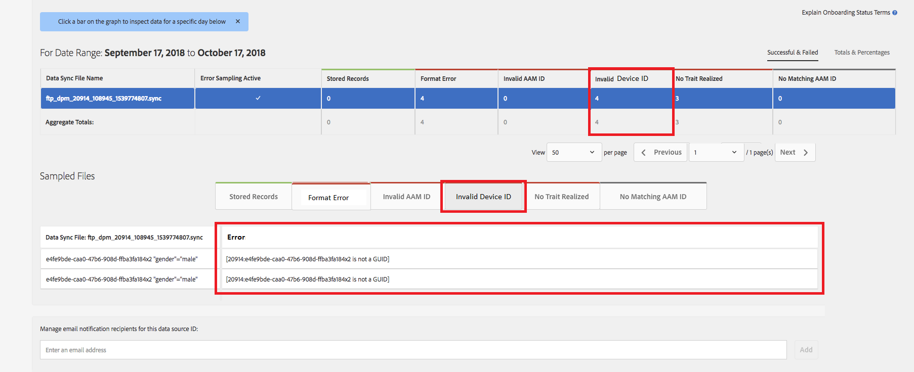

# グローバルデバイス ID の検証 {#global-device-id-validation}

デバイスの広告識別子(iDFA、GAID、Roku ID)には、デジタル広告エコシステムで使用できるようにするために満たす必要がある形式標準が含まれています。 現在、お客様とパートナーは、IDが正しくフォーマットされているかどうかを通知されることなく、任意のフォーマットでアドビのグローバル[!UICONTROL data sources]にIDをアップロードできます。 この機能では、正しいフォーマットのためにグローバル[!UICONTROL data sources]に送信されるデバイスIDの検証が導入され、IDのフォーマットが正しくない場合にエラーメッセージが表示されます。 起動時に[!DNL iDFA]、[!DNL Google Advertising]、[!DNL Roku IDs]の検証をサポートします。

## フォーマット標準の概要{#overview-of-format-standards}

次に、AAMで現在認識され、サポートされているグローバルなデバイス広告IDプールを示します。 これらは共有[!UICONTROL Data Sources]として実装され、これらのプラットフォームのユーザーに結び付けられたデータを扱う任意の顧客またはデータパートナーが使用できます。

<table>
  <tr>
   <td>プラットフォーム </td>
   <td>AAMデータソースID </td>
   <td>ID形式 </td>
   <td>AAM PID </td>
   <td>メモ </td>
  </tr>
  <tr>
   <td>Google Android(GAID)</td>
   <td>20914</td>
   <td>32の16進数。通常は8-4-4-4-12<em>例、97987bca-ae59-4c7d-94ba-ee4f19ab8c21  </em>のように表示されます。 </td>
   <td>1352</td>
   <td>このIDは、raw/unhashed/unaltered form Reference - <a href="https://play.google.com/about/monetization-ads/ads/ad-id/">https://play.google.com/about/monetization-ads/ads/ad-id/</a>で収集する必要があります。</td>
  </tr>
  <tr>
   <td>Apple iOS(IDFA)</td>
   <td>20915</td>
   <td>32の16進数。通常は8-4-4-12 <em>例、6D92078A-8246-4BA4-AE5B-76104861E7DC  </em>と表示されます。 </td>
   <td>3560</td>
   <td>このIDは、raw/unhashed/unaltered form Reference - <a href="https://support.apple.com/en-us/HT205223">https://support.apple.com/en-us/HT205223</a>で収集する必要があります。</td>
  </tr>
  <tr>
   <td>六(RIDA)</td>
   <td>121963</td>
   <td>32の16進数。通常は8-4-4-4-12 <em>例、</em> <em>fcb2a29c-315a-5e6b-bcfd-d889ba19ada</em>のように表示されます。</td>
   <td>11536</td>
   <td>このIDは、raw/unhashed/unaltered form Reference - <a href="https://sdkdocs.roku.com/display/sdkdoc/Roku+Advertising+Framework">https://sdkdocs.roku.com/display/sdkdoc/Roku+Advertising+Framework</a>で収集する必要があります。 </td>
  </tr>
  <tr>
   <td>Microsoft広告ID （メイド）</td>
   <td>389146</td>
   <td>英数字の文字列</td>
   <td>14593</td>
   <td>このIDは、raw/unhashed/unaltered form Reference - <a href="https://docs.microsoft.com/en-us/uwp/api/windows.system.userprofile.advertisingmanager.advertisingid">https://docs.microsoft.com/en-us/uwp/api/windows.system.userprofile.advertisingmanager.advertisingid</a> <a href="https://msdn.microsoft.com/en-us/library/windows/apps/windows.system.userprofile.advertisingmanager.advertisingid.aspx">https://msdn.microsoft.com/en-us/library/windows/apps/windows.system.userprofile.advertisingmanager.advertisingid.aspx</a>で収集する必要があります。</td>
  </tr>
  <tr>
   <td>Samsung DUID</td>
   <td>404660</td>
   <td>英数字文字列の例， 7XCBNROQJQPYW</td>
   <td>15950</td>
   <td>このIDは、raw/unhashed/unaltered form Reference - <a href="https://developer.samsung.com/tv/develop/api-references/samsung-product-api-references/productinfo-api">https://developer.samsung.com/tv/develop/api-references/samsung-product-api-references/productinfo-api</a>で収集する必要があります。 </td>
  </tr>
</table>

## アプリでの広告IDの設定{#setting-an-advertising-identifier-in-the-app}

アプリで広告主IDを設定する手順は、まず広告主IDを取得し、次にExperience Cloudに送信する2つの手順です。 これらの手順を実行する際のリンクを以下に示します。

1. IDを取得する
   1. [!DNL Apple] 詳し [!DNL advertising ID] くは、 [ここを参照してください](https://developer.apple.com/documentation/adsupport/asidentifiermanager)。
   1. [!DNL Android]開発者の[!DNL advertiser ID]の設定に関する情報は、[HERE](http://www.androiddocs.com/google/play-services/id.html)にあります。
1. SDKの[!DNL setAdvertisingIdentifier]メソッドを使用して、Experience Cloudに送信します
   1. `setAdvertisingIdentifier`の使用に関する情報は、[ドキュメント](https://aep-sdks.gitbook.io/docs/using-mobile-extensions/mobile-core/identity/identity-api-reference#set-an-advertising-identifier)の[!DNL iOS]と[!DNL Android]の両方に含まれています。

`// iOS (Swift) example for using setAdvertisingIdentifier:`
`ACPCore.setAdvertisingIdentifier([AdvertisingId]) // ...where [AdvertisingId] is replaced by the actual advertising ID`

## 不正なIDに対するDCSエラーメッセージ{#dcs-error-messaging-for-incorrect-ids}

誤ったグローバルデバイスID（IDFA、GAIDなど）がAudience Managerに対してリアルタイムで送信されると、ヒット時にエラーコードが返されます。 次の例は、IDが[!DNL Apple IDFA]として送信されるために返されるエラーの例です。IDは大文字のみで、IDには小文字の「x」が含まれている必要があります。

エラーコードのリストについては、[ドキュメント](https://experienceleague.adobe.com/docs/audience-manager/user-guide/api-and-sdk-code/dcs/dcs-api-reference/dcs-error-codes.html?lang=en#api-and-sdk-code)を参照してください。

## グローバルデバイスIDのオンボーディング{#onboarding-global-device-ids}

グローバル・デバイスIDのリアルタイム送信に加えて、IDに対して「[!DNL onboard]」（アップロード）データを実行することもできます。 このプロセスは、顧客IDに対して（通常はキー/値のペアを介して）データをオンボーディングする場合と同じですが、適切なデータソースIDを使用するだけで、データがグローバルデバイスIDに割り当てられます。 オンボーディングプロセスに関するドキュメントは、[ドキュメント](https://experienceleague.adobe.com/docs/audience-manager/user-guide/implementation-integration-guides/sending-audience-data/batch-data-transfer-process/batch-data-transfer-overview.html?lang=en#implementation-integration-guides)にあります。 使用しているプラットフォームに応じて、グローバル[!UICONTROL data source] IDを使用することを忘れないでください。

正しくないグローバルデバイスIDがオンボーディングプロセスを通じて送信されると、[[!DNL Onboarding Status Report]](https://experienceleague.adobe.com/docs/audience-manager/user-guide/reporting/onboarding-status-report.html?lang=en#reporting)にエラーが表示されます。

以下は、そのレポートから発生するエラーの例です。

