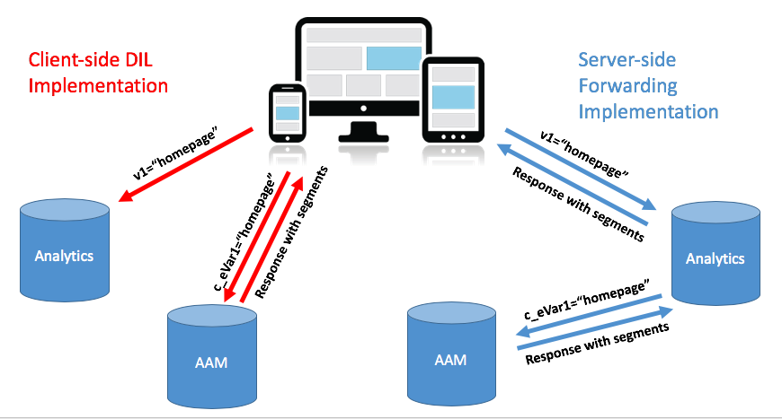
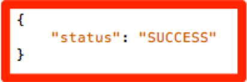

# サイトのAAM導入を[!DNL Client-Side]DILから[!DNL Server-Side Forwarding] {#migrating-your-site-s-aam-implementation-from-client-side-dil-to-server-side-forwarding}に移行する

このチュートリアルは、Adobe Audience Manager(AAM)とAdobe Analytics()の両方をお持ちで、現在、「DIL」([!DNL Data Integration Library])コードを使用してページからAAMにヒットを送信し、ページからAdobe Analyticsにヒットを送信している場合に適用されます。 これらのソリューションは両方あり、両方ともAdobe Experience Cloudの一部なので、[!DNL client-side]コードがページからAAMに別のヒットを送信する代わりに、[!DNL Server-Side Forwarding] (SSF)を有効にするベストプラクティスに従います。 [!DNL Analytics]このチュートリアルでは、古い「[!DNL Client-Side DIL]」の実装から新しい「[!DNL Server-Side forwarding]」のメソッドに切り替える手順を説明します。

## [!DNL Client-Side] (DIL)と  [!DNL Server-Side] {#client-side-dil-vs-server-side}

Adobe AnalyticsのデータをAAMに送り込む2つの方法を比較・対比する際には、まず次の図の違いを視覚化すると便利です。

### [!DNL Client-side] DIL の実装 {#client-side-dil-implementation}

この方法を使用してAdobe AnalyticsのデータをAAMに取り込む場合、ウェブページから2つのヒットがあることを意味します。1つは[!DNL Analytics]、もう1つはAAM （Webページ上の[!DNL Analytics]データをコピーした後）に移動します。 [!UICONTROL Segments] がAAMからページに返され、そこでパーソナライゼーションなどに使用できます。これは「従来の」実装と見なされ、推奨されなくなりました。

これはベストプラクティスに従っていないことを除き、この方法を使用するデメリットは次のとおりです。

* 単一のヒットではなく、ページからの2つのヒット
* [!UICONTROL Server-Side Forwarding] はとのAAMオーディエンスのリアルタイム共有に必要なため [!DNL Analytics]、 [!DNL Client-side] 実装ではこの機能（および将来他の機能が使用される可能性がある）を許可しません

AAM実装の[!UICONTROL Server-Side Forwarding]メソッドに移行することをお勧めします。

### [!UICONTROL Server-Side Forwarding] 実装 {#server-side-forwarding-implementation}

上の図に示すように、WebページからAdobe Analyticsにヒットが届きます。 [!DNL Analytics] そのデータをリアルタイムでAAMに転送し、訪問者はAAM [!UICONTROL traits] に評価され [!UICONTROL segments]、ページから直接ヒットが届いたかのように見なされます。

[!UICONTROL Segments] は、同じリアルタイムヒットでに返され [!DNL Analytics]、訪問者の個人設定などを行うためにウェブページに応答を転送します。

サーバー側転送に移動するタイミングを下げることはできません。 Audience Managerと[!DNL Analytics]の両方を持つ人には、この実装方法を利用することを強くお勧めします。

## 2つの主なタスク{#you-have-two-main-tasks}があります

このページにはかなり多くの情報が載っていて、もちろん重要なことです。 しかし、**すべては、**&#x200B;する必要がある主な2つの事柄にまとめ上げます。

1. コードを[!DNL Client-Side]DILコードから[!UICONTROL Server-Side Forwarding]コードに変更します
1. [!DNL Analytics] [!DNL Admin Console]のスイッチをフリップして、（[!UICONTROL report suite]ごとに）実際のデータ転送を開始します。

この2つのうちどちらかをスキップすると、SSFは正しく動作しません。 このドキュメントには、これら2つの手順を正しく行うための手順と追加データが追加されています。

## 導入オプション{#implementation-options}

[!DNL client-side]から[!DNL server-side]に移動する際、タスクの1つが、コードを新しい[!UICONTROL Server-Side Forwarding]コードに変更します。 これは、次のいずれかのオプションを使用して行います。

* Adobe Experience Platform Launch- Webプロパティの推奨される実装オプション。 [!DNL Launch]が全ての難しい作業を行ったので、これは非常に簡単なタスクだと分かるでしょう。
* ページ —Adobe起動を使用していない（まだ使用していない）場合は、新しいSSFコードを[!DNL appMeasurement.js]ファイル内の`doPlugins`関数に直接配置することもできます。
* 他のタグマネージャー — これらは、`doPlugins`内の他のタグマネージャーが[!DNL AppMeasurement]コードを保存している場合、常ににSSFコードを入れるので、前の（ページ上の）オプションと同じように扱えます。

「コードの更新」セクションで以下の各項目を確認します。

## 実装手順 {#implementation-steps}

### 手順0:前提条件：Experience CloudIDサービス(ECID) {#step-prerequisite-experience-cloud-id-service-ecid}

[!UICONTROL Server-Side Forwarding]に移行する主な前提条件は、Experience CloudIDサービスを実装することです。 これは、Experience Platform Launchを使用している場合に最も簡単に行えます。この場合は、ECID拡張をインストールするだけで、その他の作業も行えます。

Adobe以外のTMSを使用している場合、またはTMSをまったく使用していない場合は、他のAdobeソリューション&#x200B;**の前に**&#x200B;を実行するようにECIDを実装してください。 詳しくは、[ECIDドキュメント](https://marketing.adobe.com/resources/help/ja_JP/mcvid/)を参照してください。 その他の前提条件はコードバージョンに関するものです。以下の手順で最新のバージョンのコードを適用するだけなので、問題ありません。

>[!NOTE]
>
>実装する前に、このドキュメント全体をお読みください。 以下の「タイミング」の節は、**&#x200B;をいつ実装すべきかに関する重要な情報を持っています。ECIDを含みます（まだ実装されていない場合）。

### 手順1:DILコード{#step-record-currently-used-options-from-dil-code}から現在使用されているオプションを記録

[!DNL Client-Side]DILコードから[!UICONTROL Server-Side Forwarding]に移行する準備が整ったら、まず、AAMに送信されるカスタム設定やデータなど、DILコードで行っているすべてを識別します。 次の点に注意し、考慮する必要があります。

* [!DNL siteCatalyst.init]DILモジュールを使用した通常の[!DNL Analytics]変数 — この変数の扱いは、通常の[!DNL Analytics]変数を送り返すだけで、単にSSFを有効にするだけで済むので、心配する必要はありません。
* パートナーサブドメイン —DIL.create関数で、`partner`パラメーターをメモしておきます。 これは、「パートナーサブドメイン」または「パートナーID」と呼ばれ、新しいSSFコードを配置する際に必要になります。
* [!DNL Visitor Service Namespace] - 「[!DNL Org ID]」または「[!DNL IMS Org ID]」とも呼ばれ、新しいSSFコードを設定する場合も同様に必要です。書き留めておけ。
* containerNSID、uuidCookie、およびその他の高度なオプション — 使用しているその他の高度なオプションをメモしておくと、SSFコードでも設定できるようになります。
* 追加のページ変数 — AAMに他の変数を（siteCatalyst.initで処理される通常の[!DNL Analytics]変数に加えて）ページから送信する場合、SSF経由で送信できるように、それらの変数をメモしておく必要があります(スポイラーの警告：（[!DNL contextData]変数を使用）。

### 手順2:コードの更新{#step-updating-the-code}

上記の「導入オプション」というセクションには、[!UICONTROL Server-Side Forwarding]を導入する方法/場所に関する複数のオプションが表示されます。 この節を有効にするためには、この節に分ける必要があります（2つの節を組み合わせて）。 ニーズに最も適した説明をこのセクションの手法に進みます。

#### Adobe Experience Platform Launch{#launch-by-adobe}

Experience Platform Launch内で[!DNL Client-Side]DILコードから[!UICONTROL Server-Side Forwarding]に導入オプションを移動する方法については、以下のビデオをご覧ください。

>[!VIDEO](https://video.tv.adobe.com/v/26310/?quality=12)

#### 「ページ上」またはAdobe Tag Manager以外{#on-the-page-or-non-adobe-tag-manager}

ファイルまたはAdobe以外のタグ管理システムに存在する[!DNL Client-Side]DILコードから[!DNL AppMeasurement]コードの[!UICONTROL Server-Side Forwarding]に導入オプションを移動する方法については、以下のビデオをご覧ください。

>[!VIDEO](https://video.tv.adobe.com/v/26312/?quality=12)

### 手順3:転送を有効にする（[!UICONTROL Report Suite]ごと） {#step-enabling-the-forwarding-per-report-suite}

これまで、コードを[!DNL Client-Side DIL]コードから[!UICONTROL Server-Side Forwarding]に切り替えるのに時間を費やしてきました。 それはより難しい部分だから良い。 この節は、非常に簡単ですが、コードを更新するのと同じくらい重要です。 このビデオでは、AnalyticsからAudience Managerへのデータの実際の転送を可能にするスイッチの切り替え方法を見ていきます。

>[!VIDEO](https://video.tv.adobe.com/v/26355/?quality-12)

**注意：このビデオで説明** したように、転送の有効化がExperience Cloudバックエンドで完全に実装されるまでに最大4時間かかることに注意してください。

## タイミング{#timing}

注意喚起として、[!DNL Client-Side DIL]から[!UICONTROL Server-Side Forwarding]に移動する際には、主に次の2つのタスクがあります。

1. コードの更新
1. [!DNL Analytics] [!DNL Admin Console]のスイッチの反転

でも問題はどちらが先か？ 重要か？ 2つの質問です しかし答えは…それは依存しているし、*は*&#x200B;問題になるかもしれない。 どうやって曖昧なの？ 分けてみよう しかし、まず、多数のサイトを持つ大きな組織では、次のような疑問が浮かび上がる可能性があります。一度に何もかもやらなきゃいけないの？ あれは少し楽です。 いいえ。 一つ一つで…できます:)

### もう少し深い潜水{#a-little-deeper-dive}

タイミングと順序が重要なのは、forwarding *really *worksの仕組みが原因で、以下の技術的事実に要約できる。

* Experience CloudIDサービス(ECID)を実装していて、[!DNL Analytics] [!DNL Admin Console]のスイッチ(「the switch」)がオンの場合、コードをまだ更新していなくても、データは[!DNL Analytics]からAAMに転送されます。
* ECIDを実装していない場合、スイッチがオンになっていて、SSFコードを持っていても、データは転送されません。
* SSFコード（[!DNL Launch]内かページ上かにかかわらず）は、応答を実際に処理し、もちろん移行を完了するのに必要です。
* SSFスイッチは[!UICONTROL Report Suite]によって有効にされていますが、コードは[!DNL Launch]のプロパティで処理されます。[!DNL Launch]を使用しない場合は[!DNL AppMeasurement]ファイルで処理されます。

### ベストプラクティス {#best-practices}

これらの技術的な詳細に基づき、「何をすべきか」のタイミングに関する推奨事項を以下に示します。

#### ECIDをまだ実装していない場合{#if-you-do-not-have-ecid-yet-implemented}

1. [!DNL Analytics]で、SSFを有効にする各[!UICONTROL report suite]のスイッチをフリップします。

   1. ECIDがないので、転送はまだ開始されません

1. サイトごとに、コードを[!DNL Client-Side DIL]からSSFに更新します（[!DNL Launch]またはページ上の、上記の別のセクションで説明したように）。

   1. 転送は、（ECIDを追加したので）フローするようになり、また、[!DNL Analytics]ビーコンに対する適切なJSON応答も受け取るはずです（詳しくは、以下の「検証とトラブルシューティング」の節を参照）

#### ECIDを実装している場合{#if-you-do-have-ecid-implemented}

1. SSFを有効にするコードをDILからSSF PER [!UICONTROL report suite]に更新する準備が整うように準備し、計画を立てます。

   1. [!DNL Analytics]でスイッチをフリップしてSSFを有効にします

      1. ECIDが有効になっているため、転送WILL開始が発生する
   1. できるだけ早く、[!DNL Client-Side DIL]からSSFにコードを更新してください（[!DNL Launch]か、上の他のセクションで説明したように、ページ上にあります）

      1. [!DNL Analytics]ビーコンに対する適切なJSON応答が返されます（詳しくは、以下の「検証とトラブルシューティング」の節を参照）

**注1:** この2つの手順をできるだけ近くに行うことが重要です。上の手順1と2の間には、AAMにデータが複製されるからです。つまり、SSFは[!DNL Analytics]からAAMへのデータの送信を開始し、DILコードがまだページ上にあるので、ページからAAMに直接ヒットすることもあり、データが2倍になります。 コードをDILからSSFに更新すると、この問題は緩和されます。

**注2：データの重複が少なくても、データに小さな相違が生じたい** 場合は、上記の手順1と2の順序を切り替えることができます。コードをDILからSSFに移動すると、[!UICONTROL report suite]のSSFをオンにするスイッチを入れるまで、AAMへのデータフローが停止します。 訪問者を[!UICONTROL traits]や[!UICONTROL segments]に連絡し損ねるよりも、通常、お客様のデータが少し倍増する方がよいでしょう。

#### 多数のサイトと[!UICONTROL Report Suites] {#migration-timing-when-you-have-many-sites-and-report-suites}がある場合の移行タイミング

このトピックでは、前の節で、主な戦略を以下にまとめて簡単に取り上げます。

一度に1つのサイト/[!UICONTROL report suite]（またはサイトのグループ/[!UICONTROL report suites]）を移行します。

ただし、考えられるシナリオに基づいては、少し難しくなる場合があります。

* 複数の異なる[!UICONTROL report suites]を含むサイトがあります
* [!UICONTROL report suite]に複数のサイト（グローバル[!UICONTROL report suite]など）が含まれている
* 1つの[!DNL Launch]プロパティを使用して複数のサイトをカバーします
* 異なるサイト用に異なる開発チームがある

これらの項目があるので、少し複雑になる可能性があります。 私が提案できる最善の方法は次のとおりです。

* 上で説明した内容に基づいて、SSFへの移行の戦略を立てるのに時間がかかります。
* [!DNL Launch]（または1つの[!DNL AppMeasurement]ファイル）の1つのプロパティが1つまたは2つの異なる[!UICONTROL report suites]に対応していることに基づき、これらの異なるグループに対して1つずつ機能する計画を立て、企業をSSFに更新できるでしょう
* Adobeコンサルティングと連携している場合は、移行計画に関する相談を受け、必要に応じてコンサルティングの支援を受けるようにしてください

## 検証とトラブルシューティング{#validation-and-troubleshooting}

[!UICONTROL Server-Side Forwarding]が起動して実行されていることを検証する主な方法は、アプリから来た任意のAdobe Analyticsヒットに対する応答を調べることです。

[!DNL Analytics]からAudience Managerへのデータの[!UICONTROL server-side forwarding]を行わない場合、[!DNL Analytics]ビーコン（2x2ピクセル以外）には実際には応答しません。 ただし、SSFを実行している場合は、[!DNL Analytics]のリクエストと応答を検証できる項目があります。この項目を使用すると、[!DNL Analytics]がAudience Managerと正しく通信し、ヒットを転送し、応答を受け取っていることを知ることができます。

>[!VIDEO](https://video.tv.adobe.com/v/26359/?quality=12)

**警告：** Falseの「成功」に気を付けてください。応答があり、すべてが機能しているように見える場合は、応答に「stuff」オブジェクトが含まれていることを確認してください。そうしないと、[!DNL "status":"SUCCESS"]というメッセージが表示されるかもしれません。 これは正しく機能していない配達確認です これが見える場合は、[!DNL Launch]または[!DNL AppMeasurement]でのコードの更新が完了したが、[!DNL Analytics] [!DNL Admin Console]での転送がまだ完了していないことを意味します。 この場合は、[!UICONTROL report suite]の[!DNL Analytics] [!DNL Admin Console]でSSFが有効になっていることを確認する必要があります。 バックエンドで必要な変更を行うのにそれほど時間がかかる場合があるので、まだ4時間も経っていない場合は、忍耐強くお願いします。

[!UICONTROL Server-Side Forwarding]について詳しくは、[ドキュメント](https://marketing.adobe.com/resources/help/ja_JP/reference/ssf.html)を参照してください。
