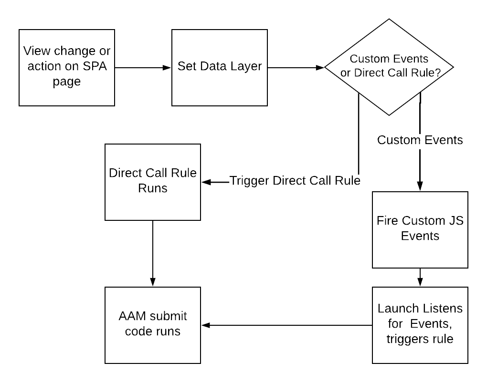

# データをAAMに送信する際のSPAページでのベストプラクティスを使用する {#using-best-practices-on-spa-pages-when-sending-data-to-aam}

このドキュメントでは、シングルページアプリケーション (SPA) からAdobe Audience Manager(AAM) にデータを送信する際のベストプラクティスをいくつか説明します。 この記事では、 [!UICONTROL Experience Platform tags]：推奨される実装方法。

## 初期メモ

* 以下の項目は、Platform タグを使用してサイトにを実装することを前提としています。 Platform タグを使用しない場合でも、これらの考慮事項は存在しますが、実装方法に合わせる必要があります。
* すべてのSPAは異なるので、要件を満たすために次の項目の一部を調整する必要が生じる場合がありますが、Adobeは、SPAページからAudience Managerにデータを送信する際に考慮する必要があるベストプラクティスを共有します。

## Experience Platformタグ（以前の Launch）でのSPAとAAMの操作に関する簡単な図{#simple-diagram-of-working-with-spas-and-aam-in-experience-platform-launch}

>[!NOTE]
>この図は、Platform タグを使用した (Adobe Analyticsを除く )Adobe Audience Manager実装でのSPAページの処理方法を簡単に示しています。 ご覧のように、かなりまっすぐな作業です。大きな決定は、表示の変更（またはアクション）を Platform タグに伝える方法です。

## SPAページからのタグのトリガー {#triggering-launch-from-the-spa-page}

Platform タグでルールをトリガーする ( つまり、データをAudience Managerに送信する ) ための、より一般的な方法は次の 2 つです。

* JavaScript カスタムイベントの設定（例を参照） [ここ](https://helpx.adobe.com/analytics/kt/using/spa-analytics-best-practices-feature-video-use.html) (Adobe Analytics)
* の使用 [!UICONTROL Direct Call Rule]

このAudience Managerの例では、 [!UICONTROL Direct Call rule] のタグに、ヒットをトリガーにします。Audience Manager。 次の節で説明するように、これは [!UICONTROL Data Layer] を新しい値に設定し、 [!UICONTROL Data Element] 」と入力します。

## デモページ {#demo-page}

以下に、SPAページでおこなうように、データレイヤーの値を変更し、Audience Managerに送信する方法を示す小さなページを示します。 この機能は、必要に応じて、より詳細な変更をモデル化できます。 このデモページは、 [ここ](https://aam.enablementadobe.com/SPA-Launch.html).

## データレイヤーの設定 {#setting-the-data-layer}

前述のように、新しいコンテンツがページに読み込まれた場合やサイトで誰かがアクションを実行した場合は、Platform タグが呼び出されて [!UICONTROL rules]を使用して、Platform タグがデータレイヤーから新しい値を取得し、それらをAudience Managerにプッシュできるようにします。

上記のデモサイトに移動し、ページのソースを見ると、次のように表示されます。

* データレイヤーは、Platform タグの呼び出しの前に、ページの先頭にあります。
* シミュレーションされたSPAリンクの JavaScript によって、 [!UICONTROL Data Layer]を呼び出してから、 `_satellite.track()` を呼び出す )。 代わりに JavaScript のカスタムイベントを使用していた場合 [!UICONTROL Direct Call Rule]の場合、レッスンは同じです。 まず、 [!DNL data layer]をクリックし、Platform タグを呼び出します。

>[!VIDEO](https://video.tv.adobe.com/v/23322/?quality=12)

## その他のリソース {#additional-resources}

* [SPAフォーラムでのAdobe](https://forums.adobe.com/thread/2451022)
* [Platform タグにSPAを実装する方法を示すリファレンスアーキテクチャのサイト](https://helpx.adobe.com/experience-manager/kt/integration/using/launch-reference-architecture-SPA-tutorial-implement.html)
* [Adobe AnalyticsでSPAをトラッキングする際のベストプラクティスの使用](https://helpx.adobe.com/analytics/kt/using/spa-analytics-best-practices-feature-video-use.html)
* [この記事で使用するデモサイト](https://aam.enablementadobe.com/SPA-Launch.html)
